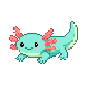
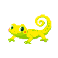
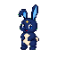

<div align="center">
  

  # PixelPet Studio

  **마스코트 한 장을, 화면 위를 걷는 픽셀 펫으로.**

  GPT·Gemini용 프롬프트와 오리지널 레퍼런스 키트, 로컬 배경 제거, 애니메이션 편집, 데스크톱 펫 실행을 하나의 Windows/macOS 앱에 담았습니다.

  [](https://github.com/obundh/pixel-pet-studio/actions/workflows/ci.yml)
  [](https://github.com/obundh/pixel-pet-studio/actions/workflows/build-desktop.yml)
  [](https://github.com/obundh/pixel-pet-studio/releases/latest)
  
</div>


## 왜 만들었나

생성형 AI는 마스코트를 픽셀아트로 바꾸는 일은 잘합니다. 하지만 같은 캐릭터를 여러 포즈에서 유지하고, 배경을 깨끗하게 지우고, 프레임을 정렬해 실제 펫처럼 움직이게 만드는 일은 여전히 제작 파이프라인이 필요합니다.

PixelPet Studio는 역할을 명확히 나눕니다.

```text
사용자 마스코트 ─┐
오리지널 스타일 ─┼─ GPT / Gemini → 생성 프레임
중립 포즈 가이드 ┘                    ↓
                    로컬 배경 제거 → 미리보기 → 데스크톱 펫
```

- **AI가 담당:** 캐릭터 이해, 픽셀아트 재해석, 포즈별 프레임 생성
- **앱이 담당:** 레퍼런스와 프롬프트 제공, 프레임 수집, 로컬 누끼, 애니메이션, 저장·내보내기, 화면 위 실행

## 들어 있는 것

- 캐릭터 정체성이 섞이지 않는 오리지널 픽셀 스타일 5종
- `idle`, `walk`, `jump`, `sleep`, `reaction` 포즈 레퍼런스 28장
- 서로 다른 실루엣을 가진 오리지널 예시 펫 5종과 변환 결과
- GPT·Gemini용 한국어/영어 2단계 템플릿과 즉시 실행 가능한 프레임 프롬프트 560개
- 4/8/6/4/6 프레임 드래그 앤 드롭 슬롯
- IMG.LY IS-Net quantized 모델을 앱에 포함한 온디바이스 배경 제거
- nearest-neighbor 애니메이션 미리보기와 PNG 스프라이트시트 출력
- 단일 파일 `.pixelpet` 프로젝트 저장/불러오기
- 투명·always-on-top 데스크톱 펫 창, 자동 이동·방향 전환·클릭 반응
- macOS Apple Silicon/Intel DMG·ZIP, Windows x64 Setup·Portable EXE 자동 빌드

## 5가지 예시 펫

| 보리 · 여우 | 무루 · 우파루파 | 나리 · 부엉이 | 초리 · 도마뱀붙이 | 도도 · 토끼 |
|---|---|---|---|---|
|  |  |  |  |  |
| Soft Cluster 16 | Pastel Dither 48 | Bold Outline 32 | Paper Cut 48 | Neon Night 32 |

모든 예시는 특정 게임, 프랜차이즈, 현존 작가를 모사하지 않고 이 프로젝트를 위해 새로 만들었습니다. 원본·스타일·완성 결과의 정확한 연결과 생성 프롬프트는 [`reference-kits`](reference-kits/README.md)에 있습니다.

## 사용 흐름

1. 앱에서 예시 펫, 스타일, 동작을 고릅니다.
2. 앱이 만든 프롬프트와 `스타일 레퍼런스`를 사용자 마스코트 이미지와 함께 GPT 또는 Gemini에 넣어 기준 픽셀 마스터를 만듭니다.
3. 기준 픽셀 마스터 + 같은 스타일 + 포즈 레퍼런스 한 장으로 각 프레임을 생성합니다.
4. 생성 이미지를 동작별 슬롯에 넣고 **배경 제거**를 실행합니다. 이미지 처리는 기기 안에서 수행됩니다.
5. 속도와 크기를 확인한 뒤 데스크톱 펫으로 실행하거나 `.pixelpet`/JSON/PNG 스프라이트시트로 저장합니다.

프롬프트는 한 번에 스프라이트시트 전체를 요구하지 않습니다. 먼저 기준 픽셀 마스터를 확정하고, 그 이미지를 가장 강한 캐릭터 레퍼런스로 사용해 프레임을 **한 장씩** 만드는 방식입니다. 상세 변수와 제공자별 템플릿은 [`docs/prompting`](docs/prompting/README.md), 5개 펫 × 28개 포즈 × 2개 제공자 × 2개 언어로 완성된 **560개 프롬프트**는 [`docs/prompting/generated`](docs/prompting/generated/README.md)에서 볼 수 있습니다.

## 로컬 실행

필수 환경은 Node.js 24 이상입니다.

```bash
npm install
npm run dev
```

첫 `dev`/`build`에서는 배경 제거용 IS-Net quantized 모델과 ONNX WASM 런타임을 공식 IMG.LY CDN에서 내려받아 `public/background-removal`에 준비합니다. 이후에는 로컬 파일을 재사용하며, 완성 앱에도 함께 패키징됩니다.

```bash
npm test          # 프로젝트 계약 + 43개 이미지/알파/참조 연결 검사
npm run typecheck
npm run build     # renderer + Electron main/preload
npm run dist:mac  # Apple Silicon/Intel DMG + ZIP (macOS에서 실행)
npm run dist:win  # NSIS installer + portable EXE (Windows에서 실행)
```

바로 실행할 파일은 [GitHub Releases](https://github.com/obundh/pixel-pet-studio/releases/latest)에서 받을 수 있습니다. GitHub Actions의 **Build desktop apps** 워크플로를 수동 실행하거나 `v*` 태그를 푸시해도 macOS와 Windows 패키지를 artifact로 받을 수 있습니다. 코드 서명 인증서는 포함하지 않았으므로 운영체제 경고를 확인해야 하며, 공개 운영 배포 전 Apple/Windows 서명을 추가하세요.

## 프로젝트 구조

```text
src/
├── main/          Electron 창, 보안 프로토콜, 프로젝트 파일, 펫 이동
├── preload/       sandbox-safe typed IPC bridge
├── renderer/      React 제작 워크플로와 펫 렌더러
└── shared/        .pixelpet 문서 및 IPC 계약
reference-kits/    43개 레퍼런스 자산과 재현 프롬프트
docs/prompting/    GPT/Gemini 한·영 템플릿과 완전 치환 프롬프트 560개
scripts/           에셋 생성·검증·로컬 모델 준비
.github/workflows Windows/macOS CI와 패키징
```

## 개인정보와 권리

- 가져온 마스코트와 배경 제거 결과는 외부 서버로 업로드하지 않습니다.
- GPT/Gemini에 이미지를 보내는 생성 단계에는 해당 제공자의 데이터 정책이 적용됩니다.
- 기관 마스코트, 로고, 브랜드 가이드의 사용 권한은 업로드한 사용자나 운영 주체가 확인해야 합니다.
- 예시 펫과 레퍼런스는 오리지널이지만 생성형 이미지 특성상 실제 배포 전 유사성 검토를 권장합니다.

원본 프로젝트 코드는 [MIT License](LICENSE)입니다. 배경 제거 기능은 AGPL-3.0으로 배포되는 `@imgly/background-removal`을 사용하므로, 앱 바이너리를 배포할 때는 해당 라이선스 의무를 함께 준수해야 합니다. 폐쇄형 상용 배포가 필요하면 IMG.LY 상용 라이선스를 검토하거나 배경 제거 구현을 교체하세요. 자세한 내용은 [THIRD_PARTY_NOTICES.md](THIRD_PARTY_NOTICES.md)에 정리했습니다.
