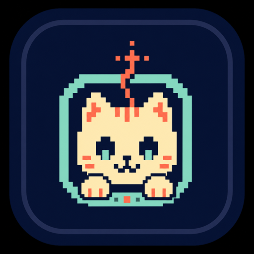
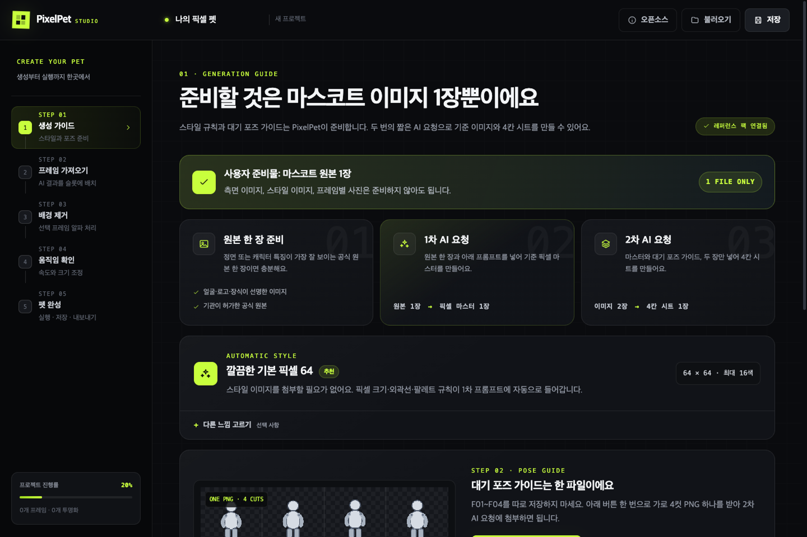
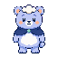
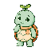

<div align="center">
  

  # PixelPet Studio

  **실제 포즈가 담긴 한 줄 시트를, 화면 위에 살아 움직이는 나만의 펫으로.**

  Windows와 macOS에서 실행되는 한국어 픽셀 펫 제작 도구입니다. 가로 포즈 시트 자동 분할, 로컬 배경 제거와 공통 좌표 정렬, 애니메이션 미리보기와 데스크톱 펫 실행을 한 앱에 담았습니다.

  [](https://github.com/obundh/korean-pixel-pet-studio/actions/workflows/ci.yml)
  [](https://github.com/obundh/korean-pixel-pet-studio/actions/workflows/build-desktop.yml)
  [](https://github.com/obundh/korean-pixel-pet-studio/releases/latest)
  
</div>

## 처음 시작하기

> 코딩, Git, Node.js를 몰라도 됩니다. 설치 파일을 받은 뒤 앱의 버튼만 누르면 사용할 수 있습니다.

> **준비할 이미지 1장 · 첫 AI 첨부 1장 · 두 번째 AI 첨부 2장 · 앱 입력 1장**

### 처음 사용하는 분

**[초보자용 처음 시작하기](START_HERE.md)**에서 다운로드, 설치, 3분 샘플, 내 이미지로 만들기, 저장까지 한 번에 따라 하세요.

- [Windows 설치](docs/beginner/INSTALL_WINDOWS.md)
- [macOS 설치](docs/beginner/INSTALL_MACOS.md)
- [GPT·Gemini로 이미지 만들기](docs/beginner/CREATE_WITH_AI.md)
- [앱 화면 따라 하기](docs/beginner/APP_WALKTHROUGH.md)
- [문제해결](docs/beginner/TROUBLESHOOTING.md)

## 다운로드

공식 [GitHub Releases](https://github.com/obundh/korean-pixel-pet-studio/releases/latest)의 **Assets**에서 내 컴퓨터에 맞는 파일을 받으세요.

| 운영체제 | 파일 이름 | 누구에게 맞나요? |
|---|---|---|
| Windows 10/11 64비트 | `PixelPet-Studio-Setup-...-x64.exe` | 설치해서 계속 사용 |
| Windows 10/11 64비트 | `PixelPet-Studio-Portable-...-x64.exe` | 설치 없이 먼저 시험 |
| Apple Silicon macOS | `PixelPet-Studio-...-arm64.dmg` | Apple M 계열 칩 |
| Intel macOS | `PixelPet-Studio-...-x64.dmg` | Intel Mac |

현재 배포 파일은 Apple과 Microsoft 코드 서명 인증서로 서명되지 않았습니다. 공식 Releases에서 받은 파일인지 확인한 뒤 운영체제 안내에 따라 열어야 합니다. 보안 기능 전체를 끄지는 마세요.

## 3분 샘플

앱이 내 컴퓨터에서 잘 실행되는지 먼저 확인할 수 있습니다.

1. `examples/beginner-pets/`에서 공개 오리지널 샘플 하나를 고릅니다.
2. 샘플 폴더 안의 `.pixelpet` 파일을 열고 GitHub 오른쪽 위 **Download raw file**로 저장합니다.
3. 앱 위쪽 **불러오기**로 해당 파일을 엽니다.
4. 왼쪽 **움직임 확인**에서 애니메이션을 봅니다.
5. **펫 완성 → 데스크톱에서 실행**을 누릅니다.

자세한 샘플 구성은 [예제 안내](examples/README.md)를 확인하세요.

## 가장 쉬운 제작 흐름

사용자가 준비할 것은 마스코트 이미지 한 장입니다. 프레임별 파일을 따로 준비할 필요가 없습니다.

```text
AI 요청 1: 원본 마스코트 1장
  → 기준 픽셀 마스터 1장

AI 요청 2: 픽셀 마스터 1장 + 앱의 대기 포즈 가이드 1장
  → 가로 4칸 시트 1장

PixelPet Studio: 가로 4칸 시트 1장
  → 4등분 · 배경 제거 · 공통 정렬 · 4 FPS 재생
```

**대기 포즈 가이드 1장에는 4컷이 한 파일에 들어 있습니다.** 스타일 이미지는 따로 첨부하지 않습니다. 기본 픽셀 규칙은 앱의 복사 프롬프트에 포함되어 있습니다.

자세한 순서는 [초보자용 처음 시작하기](START_HERE.md)에서 확인하세요.

## 이미지 한 장 빠른 모드

이미 픽셀화된 캐릭터가 한 장뿐이라면 **배경 제거 → 이미지 한 장으로 자동 완성**을 시험용으로 사용할 수 있습니다.

- PNG, JPG, WebP 지원
- 이미지 한 장당 최대 20MB · 전체 4MP(400만 픽셀) · 가로와 세로 각각 4096px
- 포즈 시트는 한 줄의 같은 너비 칸이어야 하며, 가로 픽셀 수가 선택한 동작의 슬롯 수로 정확히 나누어져야 함
- 배경 제거 이미지는 외부 서버로 전송하지 않음
- 기본 64×64 캔버스로 정규화
- 픽셀 보간 없이 또렷하게 크기 조정
- 빠른 모드는 같은 그림을 `0px → 위로 1px → 위로 1px → 0px` 이동하는 4 FPS 무왜곡 bob 루프
- 빠른 모드는 캐릭터를 늘이거나 찌그러뜨리지 않지만, 팔다리·표정·장식이 변하는 **진짜 포즈 애니메이션은 아님**

실제로 숨 쉬거나 꼬리·귀·표정이 움직이는 펫을 만들려면 아래의 포즈 시트 흐름을 사용하세요.

## AI와 앱의 역할

생성형 AI와 PixelPet Studio의 역할을 나누면 결과가 안정적입니다.

- **AI가 담당:** 캐릭터의 픽셀 재해석과 서로 다른 포즈 생성
- **앱이 담당:** 기본 스타일 프롬프트와 통합 포즈 가이드 제공, 가로 시트 등분, 배경 제거, 공통 좌표 정렬, 재생, 저장과 화면 위 실행

처음에는 대기(`idle`) 4칸 시트 한 장만 만들면 됩니다. 측면 원본, 별도 스타일 레퍼런스, 개별 포즈 파일과 다른 동작은 모두 고급 선택사항입니다.

자세한 첨부 순서와 바로 복사할 수 있는 프롬프트는 [초보자 AI 생성 가이드](docs/beginner/CREATE_WITH_AI.md)에 있습니다. 정밀한 변수와 전체 카탈로그는 [고급 프롬프트 문서](docs/prompting/README.md)에서 확인할 수 있습니다.

## 앱 화면



앱의 왼쪽 메뉴는 다음 순서입니다.

1. **생성 가이드:** 기본 픽셀 프롬프트와 대기 포즈 가이드 한 장 준비
2. **프레임 가져오기:** 가로 포즈 시트 자동 분할, 동작 전체 배경 제거·공통 정렬
3. **배경 제거:** 한 장 빠른 모드 또는 특정 프레임 수동 재처리
4. **움직임 확인:** 속도, 순서와 화면 크기 조절
5. **펫 완성:** 데스크톱 실행, 프로젝트 저장, PNG·JSON 내보내기

## 앱의 주요 기능

- 기본 64×64 픽셀 규칙이 포함된 복사 프롬프트
- 4컷이 한 파일에 들어 있는 대기 포즈 가이드
- GPT·Gemini용 한국어/영어 2단계 템플릿
- 가로 포즈 시트 자동 분할과 개별 프레임 슬롯
- IMG.LY IS-Net quantized 모델을 사용한 기기 내 배경 제거
- 동작 전체의 배경 제거·단색 경계색 정리·공통 좌표 정렬
- 픽셀 이미지 한 장의 자동 배경 제거·기본 캔버스 정규화·1px 무왜곡 대기 bob
- nearest-neighbor 애니메이션 미리보기
- 단일 파일 `.pixelpet` 프로젝트 저장과 불러오기
- PNG 스프라이트시트와 JSON 내보내기
- 투명·항상 위 데스크톱 펫 창, 자동 이동과 클릭 반응

## 실제 초보자 검증 샘플

`examples/beginner-pets/<id>/`에는 실제 포즈 시트 제작 흐름을 검증한 샘플이 들어갑니다.

- 공개 가능한 오리지널 마스코트 3종: 원본, 4칸 가로 포즈 시트, 프롬프트, 분할·정리 결과, `.pixelpet` 프로젝트 공개
- RRA 파비 로컬 전용 recipe 1종: 공식 링크와 제작 순서만 공개

| Haeori · 햇살 수달 | Mongle · 구름 곰 | Toto · 새싹 거북 |
|---|---|---|
|  |  |  |
| [샘플 열기](examples/beginner-pets/haeori-sun-otter/README.md) | [샘플 열기](examples/beginner-pets/mongle-cloud-bear/README.md) | [샘플 열기](examples/beginner-pets/toto-sprout-turtle/README.md) |

[RRA 파비 공식 마스코트 페이지](https://www.rra.go.kr/ko/intro/character.do)에는 확인 가능한 KOGL 표시가 없어 원본과 파생 이미지를 저장소에 커밋하지 않습니다. 권리자의 사전 허락 없이 결과물을 공개하거나 배포하면 안 됩니다. 자세한 경계와 문의 문안은 [RRA 파비 로컬 전용 recipe](examples/beginner-pets/rra-pavi/README.md)에 기록합니다.

## 무엇을 저장해야 하나요?

| 결과 | 용도 |
|---|---|
| `.pixelpet` | 다시 열어 편집하는 가장 중요한 프로젝트 파일 |
| 스프라이트시트 PNG | 게임 엔진이나 웹 프로젝트에서 사용 |
| 프로젝트 JSON | 개발 도구와 연결하는 고급 데이터 |

처음 사용하는 분은 `.pixelpet` 저장부터 하세요. PNG나 JSON만으로는 앱의 전체 편집 상태를 되살릴 수 없습니다.

## 초보자 문서

| 문서 | 내용 |
|---|---|
| [처음 시작하기](START_HERE.md) | 설치부터 첫 펫 실행까지 |
| [Windows 설치](docs/beginner/INSTALL_WINDOWS.md) | Setup, Portable, SmartScreen |
| [macOS 설치](docs/beginner/INSTALL_MACOS.md) | arm64/x64 선택과 Gatekeeper |
| [AI로 이미지 만들기](docs/beginner/CREATE_WITH_AI.md) | 기준 마스터와 가로 포즈 시트 생성 |
| [앱 따라 하기](docs/beginner/APP_WALKTHROUGH.md) | 포즈 시트 흐름, 빠른 모드와 1~5단계 버튼 |
| [체크리스트](docs/beginner/CHECKLIST.md) | 완성·공개 전 확인 사항 |
| [문제해결](docs/beginner/TROUBLESHOOTING.md) | 설치, 생성, 배경 제거, 저장 오류 |
| [쉬운 용어 설명](docs/beginner/GLOSSARY.md) | 프레임, 알파, FPS 등의 뜻 |

## 개인정보와 권리

- PixelPet Studio의 가져오기·배경 제거·프로젝트 저장은 사용자 컴퓨터 안에서 처리됩니다.
- GPT, Gemini 등 외부 AI에 이미지를 보내는 생성 단계에는 해당 서비스의 데이터 정책이 적용됩니다.
- 기관 마스코트, 로고와 브랜드 이미지의 사용·변형·공개 권한은 사용자가 확인해야 합니다.
- 외부 마스코트의 권리는 이 저장소의 코드·자산 라이선스로 바뀌지 않습니다.
- 예시 펫과 오리지널 레퍼런스도 공개 배포 전 유사성 검토를 권장합니다.

## 개발자용 실행

이 부분은 앱을 수정하거나 직접 빌드하려는 개발자만 필요합니다. 완성 설치 파일을 사용하는 분은 Node.js를 설치할 필요가 없습니다.

필수 환경은 Node.js 24 이상입니다.

```bash
npm install
npm run dev
```

첫 `dev` 또는 `build`에서는 배경 제거용 IS-Net quantized 모델과 ONNX WASM 런타임을 공식 IMG.LY CDN에서 받아 `public/background-removal`에 준비합니다. 이후에는 로컬 파일을 재사용하고 완성 앱에도 패키징됩니다.

```bash
npm test
npm run typecheck
npm run build
npm run dist:mac
npm run dist:win
```

GitHub Actions의 **Build desktop apps** 워크플로를 수동 실행하거나 `v*` 태그를 푸시하면 macOS와 Windows 패키지를 artifact로 만들 수 있습니다.

## 프로젝트 구조

```text
src/
├── main/            Electron 창, 프로젝트 파일, 펫 이동
├── preload/         sandbox-safe IPC bridge
├── renderer/        React 제작 화면과 펫 렌더러
└── shared/          .pixelpet 문서 및 IPC 계약
docs/beginner/        터미널이 필요 없는 초보자 설명서
docs/prompting/       GPT/Gemini 한·영 템플릿과 프롬프트 카탈로그
examples/             공개 샘플과 권리 제한 recipe
reference-kits/       오리지널 스타일·포즈·예시 펫 자산
scripts/              에셋 생성·검증·로컬 모델 준비
.github/workflows/    Windows/macOS CI와 패키징
```

## 라이선스

프로젝트 코드와 결합된 데스크톱 앱은 [GNU AGPL-3.0-or-later](LICENSE)로 배포합니다. 관리자는 판매 목적이 아니라 다른 사람의 학습과 제작을 돕기 위해 운영하지만, 라이선스에 별도의 “비상업 전용” 제한을 추가하지 않습니다.

오리지널 예시·레퍼런스 이미지는 [CC BY 4.0 자산 정책](ASSET_LICENSE.md)을 따릅니다. 기관 마스코트, 로고와 사용자 입력에는 이 허락이 적용되지 않습니다. 바이너리를 재배포할 때에는 정확한 소스를 같은 다운로드 위치에서 제공하고 [Corresponding Source 정책](SOURCE_OFFER.md)을 따라야 합니다.

배경 제거 기능의 IMG.LY 패키지, 모델, ONNX Runtime, Electron/Chromium 등 제3자 구성 요소에는 각 라이선스가 별도로 적용됩니다. 자세한 목록은 [제3자 고지](THIRD_PARTY_NOTICES.md), 모델 확인 상태는 [모델 provenance](MODEL_PROVENANCE.md), 상표 경계는 [상표 안내](TRADEMARKS.md)에 있습니다.
