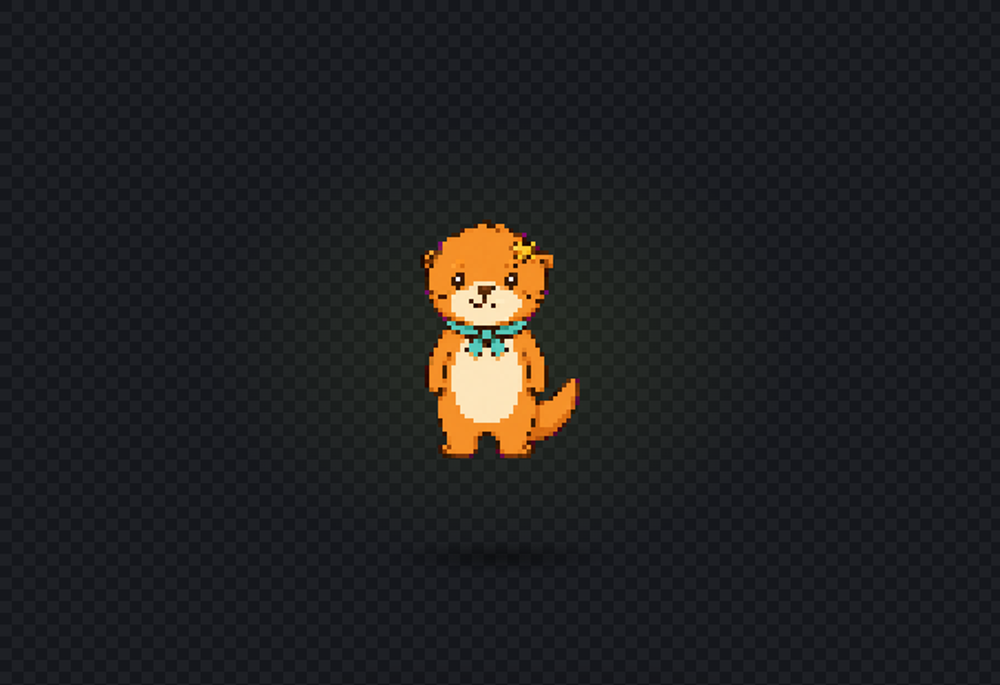

# Haeori · 햇살 수달

> 공개 오리지널 샘플 · `public: true`

Haeori는 따뜻한 주황색 몸, 크림색 배와 주둥이, 청록색 목수건, 해 모양 머리 장식을 가진 오리지널 수달 마스코트입니다. 생성형 이미지에서 픽셀 기준 이미지를 만든 뒤 PixelPet Studio의 **이미지 한 장으로 자동 완성** 경로만 사용해 대기 펫으로 완성했습니다.

## 바로 실행하기

1. [`haeori-sun-otter.pixelpet`](haeori-sun-otter.pixelpet)을 열고 GitHub 오른쪽 위 **Download raw file**로 저장합니다.
2. PixelPet Studio를 실행합니다.
3. 위쪽 **불러오기**를 누릅니다.
4. 저장한 `.pixelpet` 파일을 선택합니다.
5. **움직임 확인**에서 4프레임 대기 동작을 봅니다.
6. **펫 완성 → 데스크톱에서 실행**을 누릅니다.

## 실제 파일

| 파일 | 역할 |
|---|---|
| [`source.png`](source.png) | AI로 만든 오리지널 일반 마스코트 레퍼런스 |
| [`pixel-master-chroma.png`](pixel-master-chroma.png) | 앱의 빠른 만들기에 넣은 마젠타 배경 픽셀 기준 이미지 |
| [`generated/`](generated/) | 앱이 만든 투명 대기 프레임 4장 |
| [`haeori-sun-otter.pixelpet`](haeori-sun-otter.pixelpet) | 다시 열어 편집할 프로젝트 |
| [`haeori-sun-otter-spritesheet.png`](haeori-sun-otter-spritesheet.png) | 앱에서 내보낸 스프라이트시트 |
| [`app-preview.png`](app-preview.png) | 실제 앱의 움직임 확인 화면 |
| [`run-log.json`](run-log.json) | 파이프라인, 설정과 산출물 SHA-256 기록 |
| [`PROMPTS.md`](PROMPTS.md) | 원본과 픽셀 마스터에 사용한 정확한 프롬프트 |
| [`SOURCE_AND_RIGHTS.md`](SOURCE_AND_RIGHTS.md) | 제작 출처와 공개 범위 |

## 캐릭터 고정 특징

- 따뜻한 귤빛 주황색 수달 몸
- 크림색 타원형 주둥이와 배
- 짧은 청록색 목수건과 두 갈래 끝
- 한쪽 귀 위의 작은 금빛 해 장식
- 오른쪽 뒤로 보이는 굵고 하나뿐인 꼬리
- 팔 2개, 발 2개

## 앱에서 수행한 과정

1. **생성 가이드**에서 기본 64×64 스타일 선택
2. **배경 제거** 단계의 **이미지 한 장으로 자동 완성** 카드 열기
3. **이미지 한 장 고르기**로 `pixel-master-chroma.png` 입력
4. IMG.LY `isnet_quint8` CPU 모델로 마젠타 배경 제거
5. 앱 안에서 키 색상 거리 매트, 색 번짐 제거와 픽셀용 hard-alpha 정리
6. 알파 경계 상자를 기준으로 아래 중앙 정렬
7. nearest-neighbor 방식으로 64×64 캔버스 정규화
8. `neutral`, `inhale-up`, `soft-squash`, `exhale` 대기 프레임 4장 생성
9. 8 FPS, 화면 배율 3×로 미리보기
10. 프로젝트와 스프라이트시트를 앱에서 내보내기

[`run-log.json`](run-log.json)의 `imageProcessing`은 `PixelPet quick UI only; no external image post-processing`으로 기록되어 있습니다. 즉 `pixel-master-chroma.png`를 입력한 뒤 배경 제거, 크기 맞춤, idle 4장 구성과 내보내기는 외부 이미지 편집기 없이 PixelPet Studio 경로만 사용했습니다.

## 직접 다시 만들어 보기

완성 프로젝트 대신 입력부터 시험하려면 다음 순서로 진행하세요.

1. [`pixel-master-chroma.png`](pixel-master-chroma.png)를 저장합니다.
2. 새 프로젝트의 **생성 가이드**에서 64×64 스타일을 선택합니다.
3. **배경 제거 → 이미지 한 장으로 자동 완성 → 이미지 한 장 고르기**를 누릅니다.
4. 저장한 이미지를 선택합니다.
5. 대기 탭이 `4/4`이고 배경 제거 완료가 `4/4`인지 확인합니다.
6. **움직임 확인**에서 8 FPS와 3×를 설정합니다.
7. `.pixelpet` 프로젝트로 저장합니다.

프롬프트부터 재현하려면 [PROMPTS.md](PROMPTS.md)를 먼저 읽으세요. 프로젝트 전체의 초보자 흐름은 [처음 시작하기](../../../START_HERE.md)에 있습니다.
