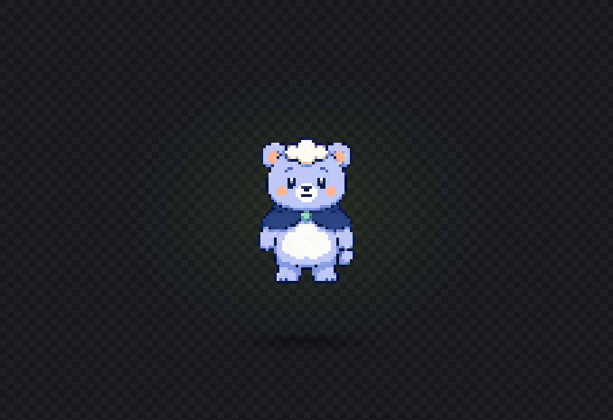

# Mongle · 구름 곰

> 공개 프로젝트 샘플 · `public: true`

Mongle은 라벤더빛 몸, 구름 모양 이마 털과 배 무늬, 짙은 남색 비 망토를 가진 구름 곰 예제입니다. 픽셀 기준 마스터를 정체성 레퍼런스로 삼아 AI에서 실제 대기 포즈 네 장을 만들고, PixelPet Studio의 **포즈 시트 한 장 가져오기 → 이 동작 한 번에 정리** 경로로 완성했습니다. 한 장짜리 빠른 모드는 이 샘플 제작에 사용하지 않았습니다.

## 바로 실행하기

1. [`mongle-cloud-bear.pixelpet`](mongle-cloud-bear.pixelpet)을 열고 GitHub 오른쪽 위 **Download raw file**로 저장합니다.
2. PixelPet Studio를 실행합니다.
3. 위쪽 **불러오기**를 누릅니다.
4. 저장한 `.pixelpet` 파일을 선택합니다.
5. **움직임 확인**에서 4프레임 대기 동작을 봅니다.
6. **펫 완성 → 데스크톱에서 실행**을 누릅니다.

## 실제 파일

| 파일 | 역할 |
|---|---|
| [`source.png`](source.png) | AI로 만든 일반 마스코트 레퍼런스 |
| [`pixel-master-chroma.png`](pixel-master-chroma.png) | 캐릭터 정체성의 픽셀 기준 마스터 |
| [`ai-idle-sheet-chroma.png`](ai-idle-sheet-chroma.png) | 왼쪽부터 중립·들이쉬기·전환·내쉬기 포즈가 있는 4칸 입력 시트 |
| [`generated/`](generated/) | 앱이 분할·투명화·공통 정렬한 `64×64` 대기 프레임 4장 |
| [`mongle-cloud-bear.pixelpet`](mongle-cloud-bear.pixelpet) | 다시 열어 편집할 프로젝트 |
| [`mongle-cloud-bear-spritesheet.png`](mongle-cloud-bear-spritesheet.png) | 앱에서 내보낸 스프라이트시트 |
| [`app-preview.png`](app-preview.png) | 실제 앱의 움직임 확인 화면 |
| [`run-log.json`](run-log.json) | 품질 검사, 실제 재생 순서와 산출물 SHA-256 기록 |
| [`PROMPTS.md`](PROMPTS.md) | 원본·픽셀 마스터·4포즈 시트에 사용한 정확한 프롬프트 |
| [`SOURCE_AND_RIGHTS.md`](SOURCE_AND_RIGHTS.md) | 제작 출처와 공개 범위 |

## 캐릭터 고정 특징

- 부드러운 라벤더빛 파란 몸
- 세 개의 둥근 덩어리로 된 크림색 구름 이마 털
- 복숭아색 귓속과 양 볼
- 흰색 구름 모양 배 무늬
- 짧은 남색 비 망토와 민트색 원형 잠금 장식 하나
- 한쪽에 보이는 작고 둥근 꼬리
- 팔 2개, 발 2개

## 앱에서 수행한 과정

1. **생성 가이드**에서 기본 64×64 스타일 선택
2. **프레임 가져오기**에서 대기 동작 선택
3. **포즈 시트 한 장 가져오기**로 `ai-idle-sheet-chroma.png` 입력
4. 앱이 `2172×724` 시트를 왼쪽부터 같은 크기의 네 칸으로 분할
5. **이 동작 한 번에 정리** 실행
6. 균일한 마젠타 배경은 IMG.LY 모델을 호출하지 않고 직접 hard-key 처리
7. 색 번짐과 어두운 마젠타 테두리를 제거하고 반투명 픽셀 없이 정리
8. 넓고 안정적인 몸통 행을 기준으로 포즈별 작은 좌우 드리프트만 상한 안에서 보정한 뒤 합집합 알파 범위와 공통 배율·최종 배치를 사용해 nearest-neighbor 방식으로 `64×64` 정렬
9. `4 FPS`, 화면 배율 `3×`로 미리보기
10. 프로젝트·스프라이트시트를 내보내고 실제 데스크톱 펫 창에서 재생 캡처

AI가 가슴, 망토, 귀와 눈처럼 국소 부위가 달라지는 포즈를 만들었고, 앱은 그 포즈를 새로 합성하거나 프레임마다 따로 확대하지 않았습니다. 앱이 담당한 것은 정확한 4등분, 투명화, 공통 좌표 정렬, 품질 검사, 재생과 내보내기입니다.

## 사람이 읽는 품질·재생 증거

[`run-log.json`](run-log.json)에는 다음 결과가 기록되어 있습니다.

- 네 출력 모두 `64×64`, 완전 불투명 또는 완전 투명한 픽셀만 사용
- 반투명 가장자리 `0`, 마젠타 계열 잔색 `0`
- 네 프레임의 발 기준선이 모두 `y=58`
- 캐릭터 전체를 늘이거나 납작하게 만든 프레임 없음
- 프레임 사이 중심 이동이 허용치보다 작고, 마지막 프레임에서 첫 프레임으로 돌아갈 때도 검사 통과
- 실제 Electron 데스크톱 펫 창에서 기대 순서와 관측 순서가 모두 `0 → 1 → 2 → 3 → 0`
- 관측 간격이 모두 `4 FPS`의 목표 간격 `250ms` 허용 범위에서 재생. 이번 실행의 정확한 값은 `run-log.json`에 기록

테스트가 단순히 “파일 네 장이 존재한다”만 확인한 것이 아니라, 화면에 표시된 프레임을 순서대로 캡처해 첫 프레임으로 자연스럽게 돌아오는 것까지 확인한 기록입니다.

## 직접 다시 만들어 보기

1. [`ai-idle-sheet-chroma.png`](ai-idle-sheet-chroma.png)를 저장합니다.
2. 새 프로젝트의 **생성 가이드**에서 64×64 스타일을 선택합니다.
3. **프레임 가져오기**에서 대기 동작을 선택합니다.
4. **포즈 시트 한 장 가져오기**로 저장한 시트를 선택합니다.
5. 대기 탭이 왼쪽부터 `4/4`로 채워졌는지 확인합니다.
6. **이 동작 한 번에 정리**를 누릅니다.
7. **움직임 확인**에서 `4 FPS`, `3×`로 설정합니다.
8. `.pixelpet` 프로젝트로 저장합니다.

### 빠른 모드는 무엇이 다른가요?

**이미지 한 장으로 자동 완성**은 같은 비트맵을 `0px → 위로 1px → 위로 1px → 0px`로 옮기는 `4 FPS` 무왜곡 bob입니다. 몸 전체를 찌그러뜨리지는 않지만 망토, 귀와 눈이 실제로 변하는 애니메이션도 아닙니다. 정지 이미지의 빠른 실행 확인에는 쓸 수 있지만 이 샘플의 제작·품질 검증 경로는 아닙니다.

프롬프트부터 재현하려면 [PROMPTS.md](PROMPTS.md)를 먼저 읽으세요. 프로젝트 전체의 초보자 흐름은 [처음 시작하기](../../../START_HERE.md)에 있습니다.

이 샘플의 생성 출처와 CC BY 적용 범위는 [SOURCE_AND_RIGHTS.md](SOURCE_AND_RIGHTS.md)를 따릅니다. 해당 표시는 프로젝트가 실제로 허락할 수 있는 권리에만 적용되며 저작권 성립, 독점성 또는 제3자 권리 비침해를 보증하지 않습니다.
